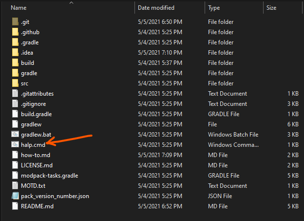
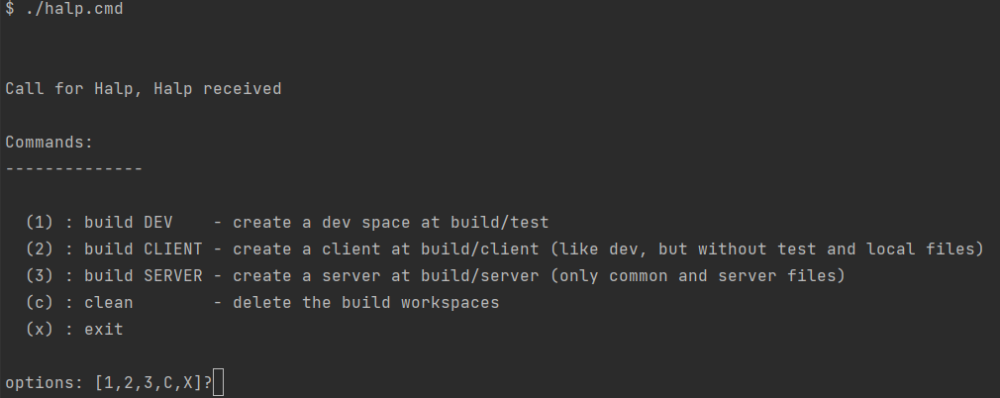

# Setup

**Prerequisites**

1. [git](https://git-scm.com/downloads)
2. [Minecraft](https://www.minecraft.net/en-us/)

## Setup Overview

1. Clone this repository.
2. Build into runnable file
3. Configure a minecraft instance

## Clone Repository

Use GIT command line, Github Desktop, or an IDE to clone the repo to a local directory.

We recommend the use of an IDE with git integration, such
as [VS Code](https://code.visualstudio.com/download)
or [Intellij Idea](https://www.jetbrains.com/idea/) to manage the workspace.

**Do not** clone directly into a minecraft instance directory. The root of the project is not a
runnable. See [Configure a Minecraft Instance](./#Configure-a-Minecraft-Instance) for more details.

## Build

The repo holds the materials to build all variants of the modpack: a client, a server version, and
a 'dev' client for development and testing purposes.

Start by building the dev/test version using the accompanying `half.cmd` script, or the
underlying `gradle` commands.

### Building with halp.cmd

1. Navigate to your local folder
2. run `halp.cmd`

   

3. Choose 1 to build DEV

   

After a few seconds, you should see a new directory, `build/test`.

**To start clean**, call halp again and use 'clean' to wipe the build workspace.

### Building with Gradle

Those more comfortable with the command line, or using an IDE with gradle integration may prefer
working directly with gradle.

```shell
# cleans the build directory. Use this to blank slate
gradlew clean

# assembles the test client at ./build/test. You can launch this with minecraft launcher or import
# into a curse forge profile
gradlew build

# assembles the client files. At this time, you'll still need to import into curseforge and export
# to get the curseForge client meta file.

# Due to config backwashing, clean and rebuild before final packaging.
gradlew packageClient

# assembles the server files (exploded). Zip it up and you should have a server. You can also test
# the server/client boundary by running the start server bat file, and connecting with a client or
# development profile.
# 
# Due to config backwashing, clean and rebuild before final packaging.
gradlew packageServer
```

## Configure a Minecraft Instance

Create a minecraft instance to run the files located in your project's `build/test` directory.

### Vanilla Minecraft Launcher

**Prerequisites**

1. Download
   Forge [1.12.2](https://files.minecraftforge.net/net/minecraftforge/forge/index_1.12.2.html)
2. Install

**Steps**

1. Open the minecraft launcher
2. Go to the `installations tab`
3. Name your installation
4. Select `1.12.2.forge...` as your version
5. Change `Game Directory` to your projects `build/test`
6. Select `More Options`
7. Increase the memory to 6 GB `-Xmx6G`

### MultiMC

1. Open MMC
2. Click Add Instance in the top left
3. Choose 1.12.2
4. Edit instance
5. Select `Install Forge`
6. Select `Instance Folder`
7. delete `.minecraft`
8. Create
   a [symbolic link](https://docs.microsoft.com/en-us/windows-server/administration/windows-commands/mklink)
   to your build output directory by open a command window here in **ADMIN MODE** and running:
    ```sh
    mklink /d "<path-to-your-instance>/.minecraft" "<path-to-your-repo>/build/test"
    ```
   ❗ If you're not building a test instance, but a client instead, be sure to change it in the path above.

   ❗ Be sure to put quotes around the target directory if there are spaces.
   
   ❗ Be sure to use normal slashes (/) and not backslashes (\\) for pointing your path.
9. in explorer, you should see the `.minecraft` with a little shortcut arrow. Confirm it linked
   properly by opening.

# Contributing

The built instances are now output. This prevents inadvertent commits of generated files.

Contribute by altering the source in the `src` directory. Depending on which subdirectory you put it
in, that content will be included or excluded from certain builds.

```yaml
src:
  # available on all versions
  common:
    - most mods and configuration
    - when in doubt, it goes here

  # only on the final client and development
  client-only: ...
    - music
    - sound
    - many artistic assets
    - client only mods that cause issues when present.
  # only on the server
  server-only:
    - mods that improve server performance
    - server specific logging configs
    - server script files
  # only on development
  test:
    - mods that are useful for dev porposes
    - alternate logging configs
  # only on development
  local:
    - things you don't want tracked
    - personal configurations and keybindings
    - credentials
```

## Development Resources and Links

[Conceptual Locations Map](https://rebirthofthenight.com/map/)

[Development Board](https://trello.com/b/PZyYdW4A/rebirth-of-the-night)

[Wiki](https://wiki.rebirthofthenight.com)
